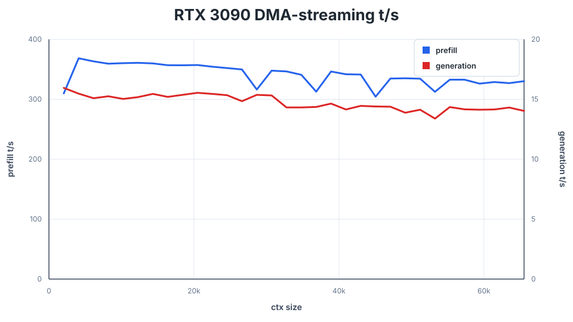

# Performance and Benchmarking

[README](../README.md)

Compare the same checkpoint, quantization, context, and sampling settings.
Record the commit and whether weights were resident, streamed, or distributed.
Keep other GPU workloads idle and repeat in alternating order: one favorable
run is not a speed result.

## Context sweeps

`ds4-bench` measures prefill and generation at successive context frontiers:

```sh
./ds4-bench -m ds4flash.gguf \
  --prompt-file speed-bench/promessi_sposi.txt \
  --ctx-start 2048 --ctx-max 65536 --step-incr 2048 --gen-tokens 128
```

Each prefill number measures the newly added interval. Generation uses a fixed
greedy, non-EOS probe. The benchmark normally restores a memory snapshot after
each probe; network TP/pipeline runs and snapshots beyond its memory limit use
prefix replay instead. Do not interpret replay time as continued-prefill speed.

Use `--step-mul F` for exponential context spacing. Output is CSV, including
prefill throughput, generation throughput, and snapshot size when available.
The prompt is the cleaned public-domain *I Promessi Sposi* text in
[speed-bench](../speed-bench/README.md).

Prefill defaults are configuration-specific: ordinary DeepSeek uses 4096-token
chunks, CUDA TP uses 2048, and long PRO prompts may use 8192. GLM chooses its
own chunks and rejects `--prefill-chunk`. The strict DeepSeek API-vector test
pins 2048; do not generalize that setting to every benchmark.

## Recorded Flash Q2 baseline

These existing sweeps use 2048-token intervals and 128 generation tokens per
frontier. They are recorded baselines, not measurements of every subsequent
commit. Full data: [M5 Max](../speed-bench/m5_max.csv) and
[DGX Spark](../speed-bench/gb10.csv).

| Machine | Context | Prefill | Generation |
| --- | ---: | ---: | ---: |
| M5 Max, 128 GB | 2048 | 790.18 t/s | 39.35 t/s |
| M5 Max, 128 GB | 16384 | 572.53 t/s | 36.14 t/s |
| M5 Max, 128 GB | 32768 | 557.04 t/s | 34.36 t/s |
| M5 Max, 128 GB | 65536 | 398.50 t/s | 27.64 t/s |
| DGX Spark, 128 GB | 2048 | 825.76 t/s | 18.05 t/s |
| DGX Spark, 128 GB | 16384 | 872.44 t/s | 15.10 t/s |
| DGX Spark, 128 GB | 32768 | 855.94 t/s | 14.43 t/s |
| DGX Spark, 128 GB | 65536 | 822.98 t/s | 13.84 t/s |


Historical PRO Q2 measurements on the M3 Ultra are retained in this chart:


## DMA streaming on a single discrete card

A 24 GB card cannot hold Flash Q2 (80.8 GiB) resident. This is a capacity
result, not a like-for-like comparison against the resident unified-memory
machines above: these rows move routed experts across PCIe on every token
via [DMA streaming](DMA_STREAMING.md), so the curve is flatter and the
absolute numbers are lower. Full data: [RTX 3090](../speed-bench/rtx3090.csv).

September 16, 2026. RTX 3090 (24 GB, sm_86), 125 GB system RAM, driver
580.173.02, CUDA 12.8, DeepSeek V4 Flash Q2 (IQ2_XXS, 80.8 GiB),
`--dma-streaming --ctx N`, no explicit `--ssd-streaming-cache-experts`
(auto-sized to 1103 experts / 7.27 GiB). 2048-token prefill intervals, 128
greedy generation tokens per frontier, average over 32 frontiers from 2K to
64K: 340.65 t/s prefill, 14.73 t/s generation.

| Machine | Context | Prefill | Generation |
| --- | ---: | ---: | ---: |
| RTX 3090, 24 GB, DMA-streamed | 2048 | 309.83 t/s | 15.95 t/s |
| RTX 3090, 24 GB, DMA-streamed | 16384 | 356.87 t/s | 15.20 t/s |
| RTX 3090, 24 GB, DMA-streamed | 32768 | 346.50 t/s | 14.32 t/s |
| RTX 3090, 24 GB, DMA-streamed | 65536 | 330.20 t/s | 14.03 t/s |



### Transport comparison at a fixed cache size

Same machine and model, `--ctx 32768`, a 512-expert cache forced explicitly
on both sides (`--ssd-streaming-cache-experts 512`, deliberately undersized
enough to thrash heavily -- ordinary use should prefer the auto-sized budget
above) to isolate the copy transport from the cache-size effect covered
above:

| | `--ssd-streaming` (pread + staging buffer) | `--dma-streaming` (registered-mapping DMA) |
| --- | ---: | ---: |
| Prefill (avg, 32 frontiers) | 68.09 t/s | -- |
| Generation (avg, 32 frontiers) | 2.71 t/s | -- |

The matching fixed-cache `--dma-streaming` sweep could not be completed in
this environment (a host-level low-memory guard repeatedly killed the
benchmark process while the host page cache warmed the 80.8 GiB model file
-- `free` dipped as expected while `available` stayed near 120 GiB the whole
time, i.e. reclaimable cache, not real pressure). The auto-sized row above
(340.65 / 14.73 t/s, more cache and the new transport together) and the
manual spot checks in [DMA streaming](DMA_STREAMING.md) (byte-identical
output across resident, `--ssd-streaming`, and `--dma-streaming` at
`--temp 0`; a 41K-token and a 126K-token prompt both completing under
`--dma-streaming`) are the evidence this PR ships; a like-for-like
fixed-cache transport number is left for a follow-up measurement on a host
without this constraint.

## What to compare next

- For SSD streaming, record the effective cache and distinguish cold startup
  from a warm cache.
- For multiple sessions, report both individual latency and aggregate
  throughput. Ordered fallback is not native batching.
- For DSpark/MTP, compare plain decode too. A faster drafter path can still be
  slower than ordinary decoding on an unpredictable prompt.
- For TP, keep quantization and prompt equal; comparing resident Q4 on two
  machines with streamed Q4 on one measures capacity benefits as well as parallelism.

Recent focused TP and DSpark comparisons, including their limitations, live in
[QA_BEFORE_RELEASES.md](../QA_BEFORE_RELEASES.md). Use its speed-regression
procedure rather than accumulating one-off timings in the main README.
